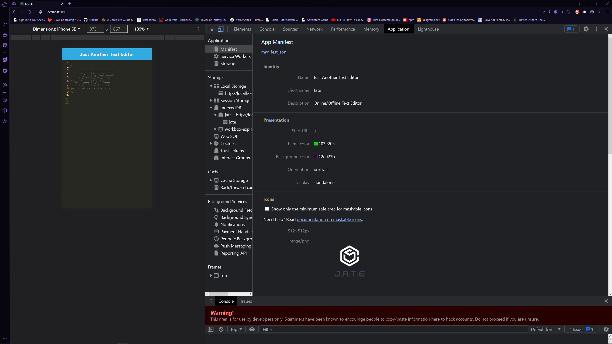
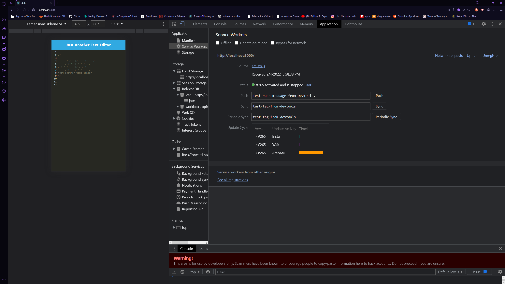
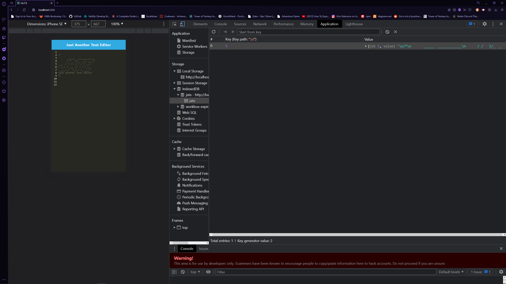

# JATE PWA Editor #

## Description ##
PWA text/code editor for use online and offline

## Table of Contents ##
* [Description](#Description "Goto Description")
* [Installation](#installation "installation")
* [Usage Info](#Usage-Info "Usage-Info")
* [Images](#Images "Goto Images")
* [License](#License "Goto License")
* [Questions](#Questions "Goto Questions")

## Installation ##
Click Install in top left corner of application in web browser.

## Usage Info ##
- Access website Here - [JATE Editor](https://bunnys-jate-editor.herokuapp.com "JATE Editor")
- Click on anyline, then use basic mark up and code editing!

## Images ##

## License ##
MIT

## Questions ##
Reach my GitHub Account, [deamonbunny](https://github.com/deamonbunny "My GitHub")